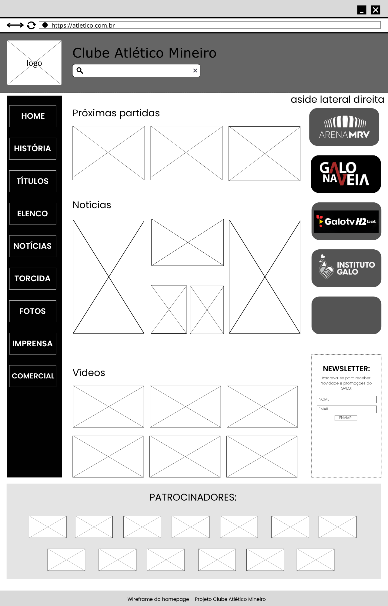

<<<<<<< HEAD

=======
>>>>>>> develop
# Trabalho Prático - Semana 04 e 05
## Informações Gerais

Nome: Luísa Braga Nery de Lima
Matrícula: 925424

<<<<<<< HEAD

=======
Proposta de projeto escolhida: Homepage - Clube Atlético Mineiro
Descrição sobre o projeto: Este projeto consiste no desenvolvimento de uma homepage sobre o Clube de futebol Atlético Mineiro, contendo informações como notícias, johistória do clube, vídeos entre outros.
>>>>>>> develop

Imagem do esboço (wireframe): 

Print da home-page criada para o projeto:
![Homepagepronta] (printHOMEPAGE.png)

![Homepagepronta2] (PrintHOMEPAGE2.png)
